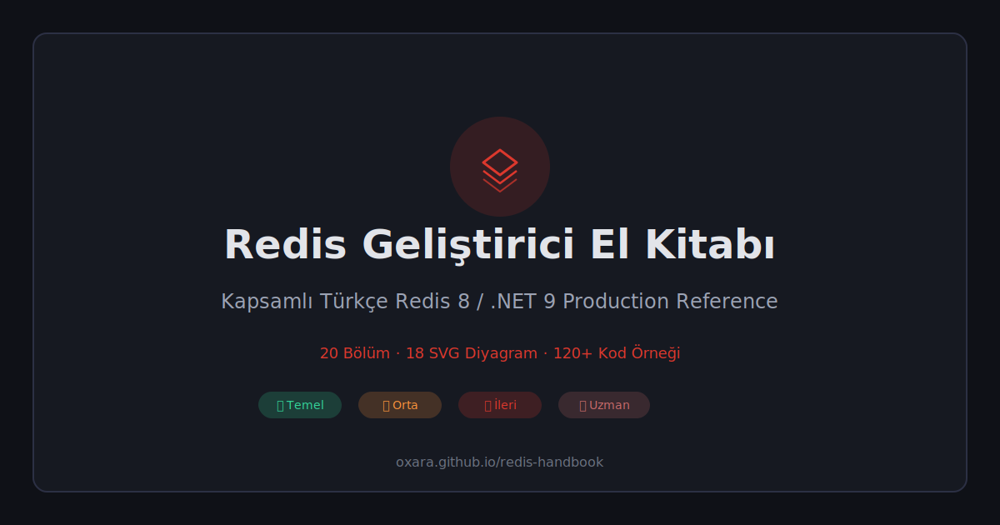

  

# Redis Geliştirici El Kitabı

**Kapsamlı Türkçe Redis 8 / .NET 10 referansı** — Temel'den uzman seviyeye, tek sayfada.

🌐 **[Canlı Site → oxara.github.io/redis-handbook](https://oxara.github.io/redis-handbook/)**

---

## İçerik

- 32 bölüm · 112+ kod örneği · 19 SVG diyagram
- Redis CLI & .NET Core örnekleri yan yana
- Kademeli zorluk: 🟢 Temel → 🟡 Orta → 🟠 İleri → 🔴 Uzman

## Kapsanan Konular

| Kategori | Bölümler |
|----------|----------|
| **Temel** | Kurulum & Bağlantı, Redis Databases, String İşlemleri, Hash İşlemleri, List & Set & Sorted Set |
| **Orta** | Caching Patterns, Pub/Sub, Redis Streams, Transactions & Lua, Geospatial, HyperLogLog, Key Expiration & Eviction |
| **İleri** | Distributed Lock (Redlock), Rate Limiting, Client-Side Caching, Pipeline & Batch, Connection Pooling, Replication & Sentinel, Cluster Mode, Testing & Benchmarking |
| **Uzman** | Health Check & Resilience, Exception Handling, Security (ACL/TLS), Session Management, Anti-Patterns, Output Cache, SignalR Backplane, Persistence (RDB/AOF), Monitoring & Observability |

## Özellikler

- 🌗 Koyu / Açık tema desteği
- 🔍 Anlık içerik araması (başlık + metin)
- ⌨️ Klavye kısayolları (`/` ara, `Esc` kapat)
- 📋 Tek tıkla kod kopyalama
- 🔀 Global toggle: Redis CLI ↔ .NET Core
- 🖨️ Yazıcı dostu (Print CSS)
- ♿ ARIA erişilebilirlik desteği
- ⚡ SVG diyagramlar ile görsel anlatım

## Teknoloji

Tek bir `index.html` dosyası — harici bağımlılık yok (marked.js & highlight.js CDN'den).

## Lisans

MIT
